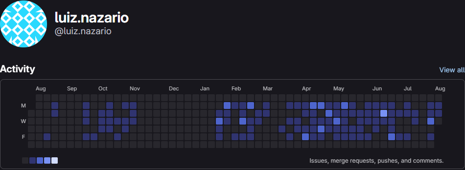

# Luiz Gabriel

Full Stack Developer building web, mobile and backend applications.

Working mainly with **TypeScript, Node.js, NestJS, Next.js, React Native, PostgreSQL and Docker**.

Currently focused on building SaaS products, modular business systems and integrations with AI and MCP.

## Professional Activity

> Aggregated contribution activity from a private corporate GitLab instance. No source code, repository details, or confidential information is disclosed.

[LinkedIn](https://www.linkedin.com/in/luiz-gabrieldeoliveira) · [Portfolio](https://nazaxinfotech.com.br) · [Email](mailto:gabrielon6689@gmail.com)
